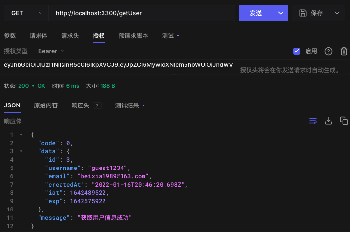

登录认证是所有后端服务器必备的功能，今天我们就来为我们的框架添加一下统一的登录认证逻辑。我们采用 JWT 的方式实现登录认证。

## 安装库

```Bash
yarn add jsonwebtoken
yarn add @types/jsonwebtoken
```

## 创建 JWT 处理模块

- 增加 secret 配置

```Bash
// .env
AUTH_SECRET=secret

```

```TypeScript
// src/config/index.ts
secret: process.env.AUTH_SECRET || 'secret'

```
- 实现 Token 的生成和解析接口

```TypeScript
// src/utils/auth.ts
import jwt from 'jsonwebtoken';
import config from '../config';

/**
 *
 * @param payload 用户信息
 * @returns
 */
export const generateToken = (payload: any): string => {
  return jwt.sign(payload, config.secret, { expiresIn: '1d' });
};

/**
 *
 * @param token
 * @returns
 */
export const verifyToken = (token: string): Record<string, any> => {
  try {
    return { data: jwt.verify(token, config.secret), error: null };
  } catch (error) {
    return { data: {}, error };
  }
};


```

## 创建认证中间件

ctx.state作为中间件消息传递的载体，具体来说就是我们给 ctx.state 对象中添加的属性和值，在其他 ctx 参数中均可以获取到，这样当我们的认证接口通过 Token 认证后，我们就可以把用户信息添加到 ctx.state 中，这样在其他的处理接口中就可以通过 ctx.state.user 拿到当前登录的用户信息。

```TypeScript
// src/middlewares/authMiddleWare.ts
import type { Context, Next } from 'koa';
import { verifyToken } from '../utils/auth';

/**
 * @description 登录认证中间件
 * @param ctx
 * @param next
 */
const authMiddleWare = async (ctx: Context, next: Next) => {
  const { authorization } = ctx.request.header;
  if (!authorization) {
    ctx.throw(401, '未登录');
  }

  const token = authorization.split(' ')[1];
  const { data, error } = verifyToken(token);
  if (!error) {
    ctx.state.user = data;
  } else {
    switch (error.name) {
      case 'TokenExpiredError':
        ctx.throw(401, '登录已过期');
        break;
      default:
        ctx.throw(400, 'Token错误');
        break;
    }
  }
  await next();
};

export default authMiddleWare;


```

## 使用中间件修饰路由

- 增加一个用户管理模块


- 增加获取用户接口

```TypeScript
// src/controller/user/view.ts
import { Context } from 'koa';
import response from '../../utils/response';

class UserController {
  async getUser(ctx: Context) {
    const { user } = ctx.state;
    if (user) {
      response.success(ctx, ctx.state.user, '获取用户信息成功');
    } else {
      response.error(ctx, '用户未登录');
    }
  }
}

export default new UserController();

```
- 增加用户信息获取路由

```TypeScript
// src/controller/user/router.ts
import KoaRouter from 'koa-router';
import UserController from './view';
import authMiddleWare from '../../middlewares/authMiddleWare';

const router = new KoaRouter();

router.get('/getUser', authMiddleWare, UserController.getUser);

export default router;

```

任何需要登录认证的路由都可以添加 authMiddleWare，这样就可以实现登录认证。还有一种方式是使用 koa-jwt 库，通过全局注册中间件为所有的路由都添加登录认证，将不需要认证的路由添加到白名单中即可。按照一般的思路来讲，我们的网站应该默认全部需要登录认证，特殊路由处理一下即可，但是我觉得 koa-jwt 那种方式不够优雅，不如在注册路由的时候，为指定路由添加 authMiddleWare。
