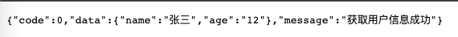
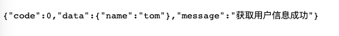

前面我们已经介绍了基础 web 框架用到的简单功能，也完善了项目文件结构，接下来业务逻辑处理只要按照目录用途添加对应的文件和逻辑就可以了。这章我们来看一下常用的请求参数获取处理逻辑。

# Post 请求体

请求体参数我们在登录和注册接口中已经使用到了，就是 ctx.request.body 中的对象，对于表单或者 Json 都可以处理，在前端通过 Post 消息的 data 携带消息体即可，这里就不再做介绍了。

# Get 查询参数

在 get 请求中，我们经常使用 ?name=xxx&age=11 这种方式传递参数给后端，koa2 中我们可以使用 ctx.query 或者 ctx.querystring 获取查询参数，通常情况下我们使用 ctx.query就行了，因为它会把我们的参数处理成对象的方式，更方便使用，而且在参数验证的处理中，我们也使用了这种方式去处理。

```TypeScript
const validate = async <T extends Value>(
  ctx: Context,
  rules: Rules,
): Promise<{ data: T; error: string }> => {
  const validator = new Schema(rules);
  let data: any = null;
  switch (ctx.method) {
    case 'GET':
      data = ctx.query;
      break;
    case 'POST':
      data = ctx.request.body;
      break;
    ......
  }

  ......
};
```

但是在一些特殊情况下，例如 ?xxxxxxx 这种请求中，参数并不是键值对的方式，而是一串字符串，这时我们就应该采用 ctx.querystring 的方式来获取其值。对于查询参数，我们写一个例子来测试一下：

- 增加查询指定用户信息接口

```TypeScript
// src/controller/user/view.ts
class UserController {
  async getUserInfo(ctx: Context) {
    console.log(ctx.query);
    response.success(ctx, ctx.query, '获取用户信息成功');
  }
}
```
- 配置路由

```TypeScript
// src/controller/user/router.ts
router.get('/getUserInfo', UserController.getUserInfo);

```

在浏览器中我们请求：http://localhost:3300/getUserInfo?name=张三&age=12，返回消息如下



# 路径参数

除了请求体参数和查询参数外，还有一类参数—路径参数，请求方式类似这种：/getUserInfo/123、/getUserInfo/231，参数获取方法非常简单：ctx.params，主要是路由定义方式有所不同，看下面的例子：

```TypeScript
// src/controller/user/view.ts
async getUserInfo(ctx: Context) {
  console.log(ctx.params);
  response.success(ctx, ctx.params, '获取用户信息成功');
}

// src/controller/user/router.ts
router.get('/getUserInfo/:name', UserController.getUserInfo);

```

我们通过浏览器访问：http://localhost:3300/getUserInfo/tom，name为tom



