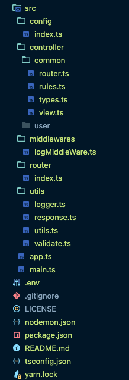

稍微大型一点的网站，路由都会有很多，因此我们一般将路由拆分到不同的文件中，但是在不同的文件中就会有一个问题，每次增加路由文件的时候，都必须在统一的路由加载模块中添加，因此为了方便使用，我们采用动态加载路由的方式，这样可以让我们添加路由就像在单文件中添加一样方便。

## 增加目录扫描函数

```TypeScript
// src/utils/utils.ts
import fs from 'fs';
import path from 'path';

/**
 * @description 遍历目录
 * @param dir
 * @param callback
 */
export const walkDir = (dir: string, callback: (file: string) => void) => {
  const files = fs.readdirSync(dir);
  files.forEach((file) => {
    const filePath = path.join(dir, file);
    const stat = fs.statSync(filePath);
    if (stat.isDirectory()) {
      walkDir(filePath, callback);
    } else {
      callback(filePath);
    }
  });
};

```

## 动态导入路由

按照规则遍历 src/controller 目录，在这个目录下，我们将所有的逻辑处理都分类为子目录，每个子目录下创建 router.ts 文件，用来配置此目录下的路由信息，然后统一加载指定的文件。使用 import 动态加载模块，并采用 koa-router 的路由叠加功能就可以实现动态加载路由了。

```TypeScript
// src/router/index.ts
import path from 'path';
import KoaRouter from 'koa-router';
import { walkDir } from '../utils/utils';

const router = new KoaRouter();

walkDir(path.join(process.cwd(), 'src/controller'), (file) => {
  if (file.endsWith('router.ts')) {
    import(file).then((controller) => {
      if (controller) {
        router.use(controller.default.routes());
        router.use(controller.default.allowedMethods());
      }
    });
  }
});

export default router;

```

目录结构如下：

