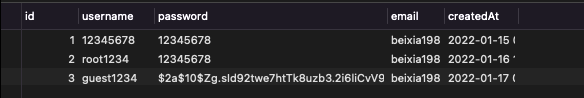

现在服务器存储密码的时候都需要采用加密存储，不能再使用明文了，除了几次大型网站的泄密问题以外，国家也严格规定不能进行明文存储。加密库我们使用bcryptjs ，因为它不需要依赖其他的库。

### 安装

```Bash
yarn add bcryptjs
yarn add -D @types/bcryptjs
```

### 加密注册密码

对于密码的处理，我们以中间件的形势进行处理，不修改现有注册逻辑，而且也熟悉一下单路由中间件的使用。

#### 创建中间件文件

```TypeScript
// src/middlewares/passwordMiddleWare.ts

import { Context } from 'koa';
import bcryptjs from 'bcryptjs';

/**
 * @description 密码加密处理请求中间件
 * @param ctx
 * @param next
 */
const encryptPassword = async (ctx: Context, next: () => Promise<any>) => {
  const { password, confirm } = ctx.request.body;
  const salt = bcryptjs.genSaltSync(10);
  if (password) {
    ctx.request.body.password = bcryptjs.hashSync(password, salt);
  }

  if (confirm) {
    ctx.request.body.confirm = bcryptjs.hashSync(confirm, salt);
  }

  await next();
};

export default encryptPassword;

```

在中间件中，如果调用了 `await next()`，就是把请求传递下去，这样我们就可以在不同的中间件中处理逻辑，如果不调用`await next()`，那么请求就不会继续传递下去，也就是后面的处理逻辑不会走到。

#### 在用户注册路由上使用

```TypeScript
// src/controller/common/router.ts
import KoaRouter from 'koa-router';
import IndexController from './view';
import encryptPassword from '../../middlewares/passwordMiddleWare';

const router = new KoaRouter();

router.post('/register', encryptPassword, IndexController.register);

export default router;

```



从数据库中的记录可以看到，我们的密码加密已经生效了，而且我们没有修改注册逻辑里面的代码。

## 加密密码验证

密码加密后，我们怎么判断用户输入的密码是否正常呢？登录逻辑中我们增加以下处理

```TypeScript
// src/controller/common/view.ts
import bcryptjs from 'bcryptjs';

class IndexController {
  async login(ctx: Context) {
    ......
    // 校验密码是否正确
    if (!bcryptjs.compareSync(data.password, user.password)) {
      response.error(ctx, '密码错误');
      return;
    }
  }
}

```