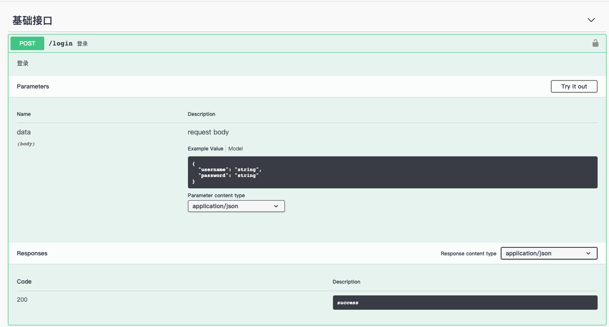

因为我们之前的框架没有接入 API 文档，而大多数 API 文档均采用 yml 的方式编写注释来生成，我不是特别喜欢这种方式，所以暂时没有添加，后来发现一个库—koa-swagger-decorator，它对 koa-router 进行了封装，可以自动生成 API 文档，而且自带验证，这种方式比较好，但是项目结构上会有一些细微的差异，因此我决定单开一个分支来使用这种方式初始化一个新的项目，大家可以选择自己喜欢的项目结构来使用，这篇文档我只介绍与之前不同的地方，如果一模一样，我就不单独写了。

## 创建项目目录

```Bash
mkdir koa2-demo

yarn init
```

## 安装依赖库

```Bash
yarn add koa koa-body koa-swagger-decorator dotenv log4js typeorm reflect-metadata mysql2 koa2-cors bcryptjs jsonwebtoken

yarn add -D ts-node typescript nodemon @types/dotenv @types/koa @types/log4js @types/reflect-metadata @types/koa2-cors @types/bcryptjs @types/jsonwebtoken
```

这里我们一次性把常用的库全部安装上，下面我大概介绍以下库的用途：

- koa-body：解析 post 参数的库，koa 默认会解析查询参数和路径参数，但是对于请求体没有解析，所以需要这个库，我们就能使用 ctx.request.body 来处理请求体了。
- koa-swagger-decorator：这个库当中集成了 路由（koa-router）、认证（validator）库，这个就不需要我们单独安装了。
- dotenv：环境变量读取库。
- log4js：日志处理库。
- typeorm、reflect-metadata、mysql2：数据库操作库。
- bcryptjs：加密库。
- jsonwebtoken：jwt 加解密库。
- ts-node：支持ts直接运行的库。
- nodemon：监控文件改变热加载的库。
- 其他：@types开头的库都是为了支持 ts 提示的，在安装库的时候使用@type/库名 ，如果可以安装就安装，如果没有就不需要安装。

接下来除了请求参数校验和路由动态加载以外，其他的均可参考之前的教程。

## 路由处理修改

```TypeScript
// src/router/index.ts
import path from 'path';
import { SwaggerRouter } from 'koa-swagger-decorator';

const router = new SwaggerRouter();

// 定义 schema 的初始信息
router.swagger({
  title: 'koa2 基础 API',
  description: 'API',
  version: '1.0.0',
});

// 这里会动态的检索 controller 目录下的所有 .js、.ts 文件，并获取默认导出类，生成路由和API
// 因此就不需要我们再收到注册路由和自己实现动态加载路由的功能了，具体的路由格式请参考 controller
// 目录下的实现
router.mapDir(path.resolve(__dirname, '../controller'));

// 重定向/路由到/swagger-html路由，这是默认的API文档路由地址
router.redirect('/', '/swagger-html');

export default router;

```

## 业务逻辑修改

之前我们通过在 controller 下创建子目录及指定名称的文件来区分业务逻辑，例如

```JSON
- controller
  - common
    - view.ts
    - router.ts
    - rules.ts
    - types.ts
```

现在我们可以简化这个目录，结构如下：

```JSON
- controller
  - common
    - view.ts
    - schema.ts
```

其中 view.ts 中实现我们的业务逻辑，schema.ts 中定义我们的参数信息，用来进行参数验证和API文档生成。

### 修改登录逻辑

```TypeScript
// src/controller/common/view.ts
import { Context } from 'koa';
import bcryptjs from 'bcryptjs';
import { request, summary, body, tags } from 'koa-swagger-decorator';
import response from '../../utils/response';
import { loginRules } from './schema';
import User from '../../entity/User';
import { generateToken } from '../../utils/auth';

export default class IndexController {
  @request('post', '/login')
  @summary('登录')
  @tags(['基础接口'])
  @body(loginRules)
  static async login(ctx: Context) {
    const data = ctx.request.body;
    // 校验用户是否存在
    let user: User | undefined = await User.getUserInfo(data.username);
    if (!user) {
      response.error(ctx, '用户不存在');
      return;
    }

    // 校验密码是否正确
    if (!bcryptjs.compareSync(data.password, user.password)) {
      response.error(ctx, '密码错误');
      return;
    }

    const { password, ...rest } = user;
    const token = generateToken(rest);
    response.success(ctx, { token }, '登录成功');
  }
}

```

主体逻辑基本没有变化，有几个需要注意的点

- 类必须使用 export default 导出，路由扫描时会通过这个进行验证（必须）
- 使用@request装饰器修饰函数，参数为方法类型和地址，路由注册是就会根据这些生成，而不是根据我们的函数名（必须）
- 函数应该定义成静态的，因为在使用的时候并不会创建类对象，使用静态方法更符合状况（可选）

我们访问：http://localhost:3100/ 就可以看到API文档



### 路由修饰参数的意义

路由装饰器分为两种：函数装饰器和类装饰器

#### 函数装饰器

- request：定义路由方法和地址，用于注册路由和API接口文档
- summary：API 文档中的路由解释，参考上图
- tags：路由分类，API 文档中用来对多个路由进行分组显示。
- query：查询参数：url?name=xxx&age=12
- path：路径参数：/getuserinfo/{id}
- body：请求体参数
- formData：表单数据。
- middlewares：koa中间件，eg：[md1, md2]
- security：
- description：接口描述
- responses：接口返回值，可以设定不同的状态返回不同的数据
- deprecated：

#### 类装饰器

- orderAll：参数为数字，表示在文档中的位置。
- tagsAll：此类下的所有路由都属于这个tag。
- responsesAll：此类下的所有路由都返回这种类型。
- middlewaresAll：此类下的所有路由都拥有的中间件。
- securityAll：
- deprecatedAll：
- queryAll：此类下的所有路由都拥有的查询参数，与函数的查询参数会合并。

### 参数验证

参数校验支持：string, number, boolean, object, array。在object和array里面的参数也支持校验，对于integer类型是不支持校验的，会直接返回其值。默认是开启校验的，可以通过配置关闭校验。

```TypeScript
router.mapDir(__dirname, { doValidation: true})
```

经过校验的数据可以通过ctx.validatedBody等方式获取经过校验的数据了，对应关系如下：

- ctx.query  ≤==> ctx.validatedQuery
- ctx.params  ≤==> ctx.validatedParams
- ctx.request.body  ≤==> ctx.validatedBody

#### 校验对象配置

- 基础校验字段

|             |         |                                |
| ----------- | ------- | ------------------------------ |
| 字段        | 值类型  | 备注                           |
| required    | boolean | 必须参数                       |
| example     | any     | 参数类型，API 文档中使用的示例 |
| description | string  | 接口描述                       |
| readOnly    | boolean | 只读参数                       |
| writeOnly   | boolean | 只写参数                       |
| nullable    | boolean | 是否可以为空                   |

- 字符串类型

|           |          |                        |
| --------- | -------- | ---------------------- |
| 字段      | 值类型   | 备注                   |
| type      | 'string' |                        |
| minLength | number   | 最小长度，实测不会校验 |
| maxLength | number   | 最大长队，实测不会校验 |
| format    | string   | 格式校验，email        | uuid | ipv4 | ipv6 | date | byte |
| pattern   | string   | 正则验证               |

- 数值类型

|                  |          |      |
| ---------------- | -------- | ---- |
| 字段             | 值类型   | 备注 |
| type             | 'number' |      |
| minimum          | number   |      |
| exclusiveMinimum | boolean  |      |
| maximum          | number   |      |
| exclusiveMaximum | boolean  |      |
| multipleOf       | number   |      |

- 布尔类型

|      |           |      |
| ---- | --------- | ---- |
| 字段 | 值类型    | 备注 |
| type | 'boolean' |      |

- 数组类型

|             |                 |      |
| ----------- | --------------- | ---- |
| 字段        | 值类型          | 备注 |
| type        | 'array'         |      |
| minItems    | number          |      |
| maxItems    | number          |      |
| uniqueItems | boolean         |      |
| items       | PropertyOptions |      |

- 对象类型

|               |          |      |
| ------------- | -------- | ---- |
| 字段          | 值类型   | 备注 |
| type          | 'object' |      |
| properties    | any      |      |
| minProperties | number   |      |
| maxProperties | number   |      |
